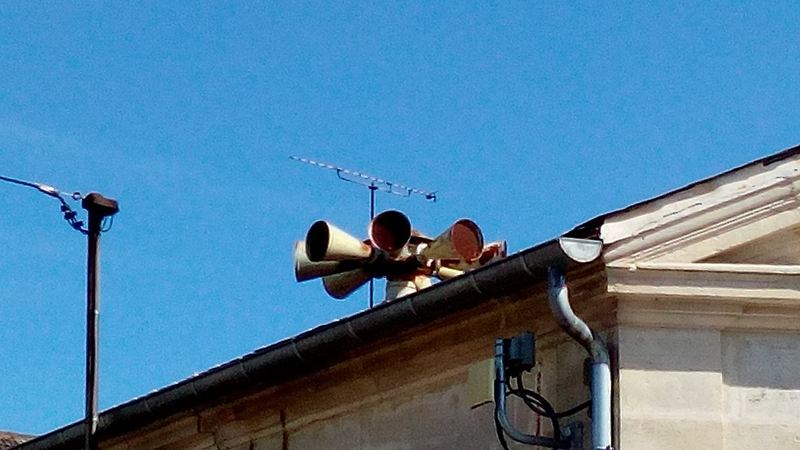
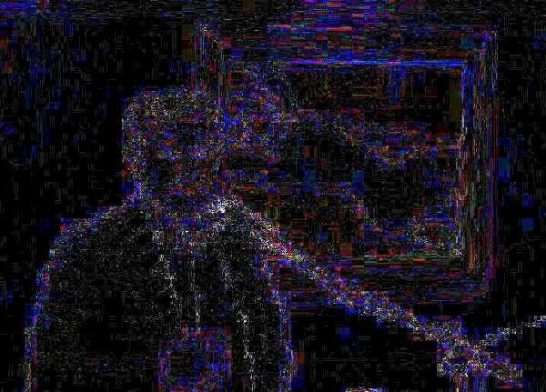
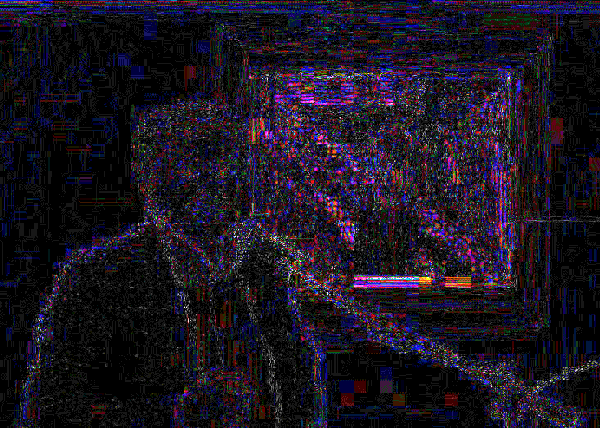
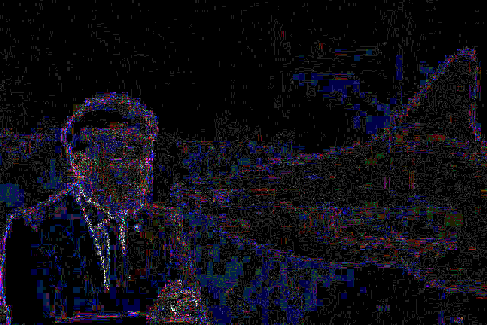

# Matériel

## Les unes

- article_1.png 
- article_2.png

Une seule de ces deux unes a vraiment été publiée. L'autre a été créée de toute pièces (avec l'extension X-ray-goggles)

Saurez-vous trouver quelle une est authentique et n'a pas été modifiée ?
Saurez-vous trouver la une qui a été modifiée ?

Solution : 

On peut utiliser l'image article_1.png, faire une recherche inverse d'images en sélectionnant la sirène et en ajoutant dans Google Images une expression provenant du titre (par exemple "déroutent les touristes")

On obtient un article de [Slate](http://www.slate.fr/story/229763/etrangers-sirenes-premier-mercredi-mois-france-touristes-alarme-alerte)

Comme le deuxième article a la même présentation que le premier, il doit venir également de Slate. On peut faire une recherche dans Slate avec le mot-clé tortue et parcourir les vignettes des résultats obtenus. On accèdera de cette manière à l'[article qui a vraiment été publié](http://www.slate.fr/story/229967/thailande-animaux-vivants-valises-aeroport-saisie-trafic-illegal-tortues-lezards-sepents) 
Par chance, l'image n'a pas été modifiée.

## Les photographies 

### ministre.jpg

#### consigne

Faire une recherche inverse d'images avec Google Images. Lire quelques résultats et recomposez l'histoire : 
de quel ministre s'agit-il ? 
Qu'est-ce qui a été changé dans l'image (par rapport à l'image originelle)
Retrouvez la version originelle de l'image (utiliser tineye.com pour cela)

#### solution
Une recherche avec Google Images permet d'accéder assez vite à ces réponses : le ministre en question est Euclides Tsakalotos. Son discours a été prononcé devant un tableau de Modigliani. Des internautes ont changé plusieurs fois cet élément de décor, notamment en remplaçant ce tableau par Le Cri d'Edward Munch. 

## requin.jpg

### consigne

Cette photo de Macron devant un aquarium contenant un requin est-elle authentique où a t-elle été produite suite à un montage ?

### solution

faire une recherche inverse d'images, sélectionner avec soin les résultats obtenus. 
Au besoin on peut remonter à la photo originale avec [tineye](https://www.tineye.com)

### bonus

Petit plus pour les étudiants intéressés:

L'observation des différents niveaux de compression (ELA Error Level Analysis) peut nous permettre de repérer des portions d'images qui auraient été collés dans l'image à analyser. 
Si l'on compare entre eux les contours d'une part, les zones homogènes de l'autre, et si l'on repère des différences (un contour ténu ici, brillant là), un aplat blanc ici, sombre là, on peut suspecter que les formes qui sont d'une couleur différente proviennent d'un copier-coller et donc que l'image est un montage.
Invid permet de mener sur les photos une analyse de type ELA (et plusieurs autres analyses en vue de la même fin).

Avec Invid, comparer les filtres (notamment ELA) des deux photos : celle qui fait l'objet d'un montage (Tsakalotos) et celle qui n'a pas été modifiée.

Tsakalotos avec Modigliani en arrière-plan

Tsakalotos avec Munch en arrière-plan

Par comparaison (image non traffiquée), Macron et les requins : 

