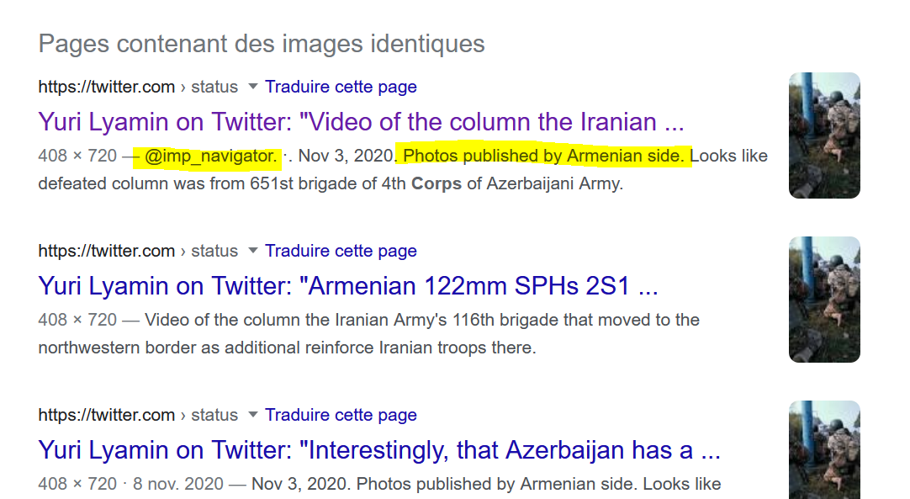

# Identification du matériel vidéo

## inventaire des vidéos

Le dossier comporte 4 vidéos sous la forme de fichiers .mp4

- tir_roquettes.mp4 (également [disponible en ligne](https://video.twimg.com/ext_tw_video/1314222618971648003/pu/vid/1280x720/NESraXGuI51n_AD0.mp4)) : 

légende à indiquer à côté de la vidéo :  images prises sur le terrain par une chaîne de télévision ukrainienne du côté de Kharkiv

- bombardement.mp4 : 
légende à faire figurer : vidéo prise le 26 avril 2022 à Kyev.

- bataille_rue.mp4
légende à faire figurer : l'avancée des Russes à Severodonesk

- emeute.mp4 (également [disponible en ligne](https://video.univ-rennes1.fr/permalink/v1264071880cfzucp9lt/iframe/))
légende à faire figurer :  scène de manifestation réprimée à Caracas par les Forces de l'ordre 

## Solutions et méthode pour parvenir à identifier ces vidéos

### Méthode générale : 

Il n'existe pas d'outil accessible à tous permettant de faire un lien direct entre une vidéo et l'ensemble des vidéos indexées sur les moteurs de recherche. 
Une vidéo peut-être identifiée de trois façon différentes : 

- avec un oeil (et une oreille) attentif : repérer les inscriptions sur l'image (noms de rue, graffitis, panneaux routiers, uniformes, symboles, architectures caractéristiques ou immeubles connus). Identifier les langues parlées. 
- en prenant une capture d'écran de la vidéo qui nous paraît significative et en faisant une recherche inverse d'images avec Google Images ou Yandex. On peut automatiser le processus de captures d'images fixes au moyen d'un outil comme Invid (fonctionnalité keyframes) et sélectionner les captures qui nous paraissent les plus significatives pour faire une recherche inverse (invid fait cette recherche inverse dans Google Images)
- en utilisant les métadonnées de la vidéo. Bien que dans bien des cas, les métadonnées des vidéos soient effacées lorsqu'elles sont postées sur Youtube ou d'autres plateformes d'échanges de vidéos en ligne, cela peut fonctionner quand on trouve la vidéo sur d'autres sites.

### Solutions 

#### tir_roquettes.mp4

Méthode suivie : 
peu de détails sur la vidéo, mais tout-de-même le logo de la chaîne de télévision. 
Une recherche inverse sur ce logo montre qu'il ne s'agit pas d'une chaîne ukrainienne mais de la chaîne Alghadeer, une chaîne irakienne.
Par ailleurs, l'analyse des métadonnées de la vidéo avec Invid (Metadata) montre que la vidéo date de 2020 et non pas de 2022. 
Il ne s'agit pas en tout cas d'une scène filmée depuis le déclenchement de l'invasion de l'Ukraine par la Russie
[https://video.twimg.com/ext_tw_video/1314222618971648003/pu/vid/1280x720/NESraXGuI51n_AD0.mp4](https://video.twimg.com/ext_tw_video/1314222618971648003/pu/vid/1280x720/NESraXGuI51n_AD0.mp4)

#### bombardement.mp4

Peu d'images. On n'a pas l'embarras du choix pour choisir une capture. Une recherche inverse d'images sur Google permet d'accéder à un [article du Midi Libre en ligne](https://www.midilibre.fr/2022/06/26/guerre-en-ukraine-poutine-veut-nucleariser-la-bielorussie-des-frappes-sur-kiev-ce-dimanche-matin-10397512.php. Cet article confirme la date et le lieu de l'événement. 

#### bataille_rue.mp4

l'usage de la fonctionnalité keyframe d'invid permet de sélectionner un soldat de dos avec un pylone bleu caractéristique. La recherche inverse d'images permet d'obtenir ces résultats : 

Le [tweet de @navigator_imp](https://twitter.com/imp_navigator/status/1325349888335491074)permet de situer l'action au Haut-Karabach, lors du conflit opposant les forces arméniennes et azerbaïdjanaises

#### emeute.mp4

Invid est peu efficace identifier cette vidéo. 
Il vaut mieux s'en remettre à une attentive des images qui la composent. 
Cette manifestation comporte certains invariants (drapeau anarchiste, ACAB, uniformes des policiers anti-émeutes) qui ne disent pas grand-chose du contexte. Des inscriptions sur les murs montrent qu'on est dans un pays hispanophone ("organiza la revolta")

Si l'on se base sur le minutage de la vidéo enregistrée sur [https://video.univ-rennes1.fr](https://video.univ-rennes1.fr/videos/panique-a-redac-emeutes-urbaines/) :

0:14, 0:27, 1:00 : on voit apparaître à plusieurs reprises un drapeau à franges noires et à bandes horizontales bleu clair, vert, rouge, frappé d'un disque jaune.
Il ne semble pas correspondre à un pays en particulier, mais plutôt à une minorité ethnique qui -en l'occurrence manifeste pour sa reconnaissance. 
Le web visible est un répertoire de listes et de bases de données majoritairement rédigées en anglais. 
Une requête comme "ethnic flags list", "indigenous flags list" , "autochtonous flags list"ou "cultural flags list" permet d'obtenir des listes de drapeaux tels que ceux-ci : 
https://commons.wikimedia.org/wiki/Cultural_flags
https://en.wikipedia.org/wiki/Ethnic_flag
En suivant cette piste, on peut identifier l'ethnie mapuche (Araucaniens)
Le peuple Mapuche est présent au Chili et en Argentine. 

entre 0:14 et 0:27, lorsque les policiers sortent du camion, ils passent devant une inscription sur un mur en bleu clair : *ni un ojo menos* (plus un seul oeil en moins). 
0:27 un policier apparaît à gauche de l'écran qui ne porte pas son gilet pare-balles. Sa veste porte l'inscription *Carabineros de Chile* (c'est assez flou cependant).

Interroger un moteur de recherche sur cette expression permet de se rendre compte qu'elle était usitée pendant les manifestations au Chili contre l'ancien gouvernement de Pinera (voir par exemple [cette video sur Youtube](https://youtu.be/JZ8vIWhO5lA)). Ce mot d'ordre dénonce les violences policières qui comme en France pendant la Crise des Gilets Jaunes ont pour effet d'éborgner certains manifestants.
Suite à cette investigation, nous pouvons conclure que cette vidéo n'a pas été prise à Caracas, mais quelque part au Chili entre 2019 et 2022

**bonus : où la photo a t-elle été prise ?**

A 0:27, On repère en arrière plan du groupe de manifestants, un bâtiment à l'allure caractéristique : le toit est constitué de lignes brisées avec une bordure rouge.

Cet élément urbain est suffisamment rare pour faire l'objet d'une recherche.
Il est probable que cet abri aux formes singulières abrite l'entrée d'un souterrain, d'un métro ou des caisses permettant d'obtenir des tickets de transport. 
On peut voir aussi dans l'article Wikipédia consacré aux récentes émeutes au Chili, que c'est l'augmentation du ticket de métro qui a initié le mouvement social et que les manifestants se sont d'abord massés autour des stations de métro à Santiago. 
On part sur cette hypothèse et des recherches combinées dans deux langues avec Google Images (metro station santiago chile protest + estacion metro santiago chile manifestacion) permet d'obtenir [un autre cliché du même lieu avec le même abri caractéristique](https://www.aa.com.tr/en/americas/20-killed-in-chile-protests-against-rise-in-metro-fares/1630338), malheureusement sans légende précise sur le lien. 
Cette image ne contient plus aucune métadonnée d'après Exif Viewer. Lorsqu'on fait une recherche inverse dans Yandex.com pour obtenir d'autres clichés du même lieu, on parvient à une autre vue, également extraite d'un [site d'information turc](https://www.yenisayi.com/silideki-gosterilerde-olenlerin-sayisi-20ye-yukseldi/)
En cherchant à nouveau les métadonnées avec exif viewer ou Invid, cette fois on a plus de chances : 

On obtient le nom du photographe (Alberto Valdes), un repère chronologique (la manifestation a pu se produire plusieurs jours au même endroit : fin octobre 2019) et surtout la réponse à notre question : il s'agit de la Place d'Italie à Santiago (Plaza Italia), ce qu'une recherche avec Google Street View permet de confirmer (on y retrouve le même élément d'architecture, mais cette fois peint en vert, le cliché à été pris par une google car deux ans plus tôt)